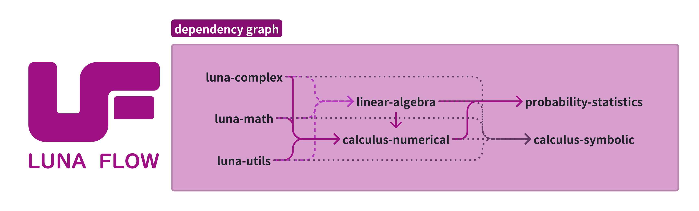

# PLCT 实验室-MoonBit-J139-可做任务清单

该清单为 中科院软件所 PLCT 实验室甲辰计划 J139 MoonBit 软件开发实习生岗位的可做任务清单、技术栈要求及对应的参考资料。

大家可以在群里和我说或者发 PR 来认领任务，任务的参与人数是不限的，但是要保证你们合作的成员之间有足够的沟通和交流。

也欢迎各位 MoonBit 社区成员和实习生来这里发布自己的需求和任务！(就是不保证会做就是了哈哈哈)

而且在有 Assignment 之后也可以给对应的产出仓库发 pr，因为它们不一定做完了所有要求或者额外任务。

[目前我们岗位还很缺人！很缺人！很缺人！欢迎在校生来投递简历！](https://github.com/plctlab/weloveinterns/blob/master/open-internships.md#j139-moonbit-%E5%BA%94%E7%94%A8%E5%BC%80%E5%8F%91%E5%AE%9E%E4%B9%A0%E7%94%9F20241104%E5%BC%80%E6%94%BE100%E5%90%8D)

## MoonBit Core 社区贡献

- Publisher: @Lampese

- Assignment: -

#### 任务内容

MoonBit Core 是 MoonBit 目前的标准库，在它的 Issues 中有许多标着 Good First Issue 这样 Label 的 Issue，它的意思是鼓励参与社区贡献的新人参与的，和其他部分耦合程度不高，比较容易完成的任务。

我们可以选择其中自己可以完成的部分去完成，通过提交 Pull Request 来参与贡献。

#### 要求

需要一定的社区沟通能力和进阶的 Git 操作能力。

#### 参考资料
- MoonBit Core: https://github.com/moonbitlang/core

<br>

## XML/YAML Parser

- Publisher: @Lampese
- Assignment(XML): @RuifengFu
- Assignment(YAML): @E-M-T-F

#### 任务内容

XML (Extensible Markup Language) 与 YAML (YAML Aint Markup Language) 均为现在市面上较为常用的标记语言 (虽然 YAML 说他们重心不在这里)，前者被广泛用于信息传递，而后者广泛用于配置文件的编写。而编写他们的 Parser (即完成从 Text -> MoonBit enum) 是十分有意义的工作。

另外，JSON (JavaScript Object Notation) 是一种数据交换格式，MoonBit 的标准库 Core 中已经编写了其 Parser，用于 JSON 文本的解析。

#### 要求

需要一定的学习技能和资料查询能力。

#### 任务预期

初步编写 XML 或 YAML 的解析器并存在放某个仓库中，可以优先学习和尝试 Parser-Combinator 的方法来体验 Functional-Programming 的乐趣 :)，但是不用它也可以，最后编写相关测试确保解析库运行正常。

项目完善后可以向 moonbitlang/x 提出 PR 并且合并该功能进入存储库，作为 MoonBit 标准库拓展的一部分。

#### 额外任务

MoonBit 官方提供了一个属性测试框架 moonbitlang/quickcheck，对于测试 Parser 类的软件非常有用，可以自己学习并且用它来测试我们写的 Parser。

也可以考虑不止支持从 String 中进行解析而是从 Iter[Char] 中解析来获得更高的性能。

#### 参考资料

这部分资料明显不全，希望大家可以自己发挥自己的能力运用搜索引擎和 AI 查找编写 Parser 的方法等等。

- XML: https://zh.wikipedia.org/wiki/XML
- YAML: https://zh.wikipedia.org/wiki/YAML
- MoonBit Core 中的 JSON Parser: https://github.com/moonbitlang/core/tree/main/json
- MoonBit 社区的 Parser Combinator: https://mooncakes.io/docs/#/peter-jerry-ye/parser-combinator/
- MoonBit X: https://github.com/moonbitlang/x
- MoonBit Quickcheck: https://github.com/moonbitlang/quickcheck

#### 产出
xml: https://github.com/RuifengFu/XMLParser

<br>

## libtorch 的 MoonBit 绑定

- Publisher: @Lampese @tonyfettes
- Assignment: @liuly0322

#### 产出

WIP，欢迎尝试/issue/PR！

tch-mbt: <https://github.com/liuly0322/tch-mbt>

#### 任务内容

libtorch 是 pytorch 的 C++ 版本，支持 CPU 端和 GPU 端的部署和训练，发行方式为 dll 或者 so，在 C++ 上可以非常简单的使用。

当前 MoonBit 在计算需求上需要在 Native 后端上增加一个 libtorch 的绑定，让 MoonBit 代码编译为 Native 代码之后也可以调用 libtorch，这可能还会帮助 torch.mbt 的进一步开发。

#### 要求

需要一定的 C 编程能力，对 pytorch 或者 libtorch 的 API 比较熟悉。

#### 任务预期

用 C 配合 MoonBit 编写出 libtorch 的 MoonBit Bindings，并且发布到 mooncakes。

可以先支持某个系统(如 Windows 或 Linux)的某个计算平台(如 CUDA 或 CPU 甚至 ROC)，然后再编写另一个平台的 bindings。

#### 额外任务

可以尝试使用自己辨析的 libtorch 库复现一些十分简单的论文和 torch 的需求。

#### 参考资料

- MoonBit Native FFI 的方法: https://github.com/moonbitlang/x/tree/main/fs/internal/ffi
- MoonBit Native Headers (在下载的压缩包中): https://www.moonbitlang.com/download/
- libtorch: https://pytorch.org/

<br>

## MoonBit 字符串格式化库

- Publisher: @Lampese
- Assignment: @kesmeey

#### 任务内容

很多编程语言都有一个输出流函数叫做 prinf，它的意思是 print with format，也就是按照某种格式输出，比如我们在 C/C++ 中想要输出一个保留三位小数的 double 类型变量，我只需要这样做：

```cpp
double xunyoyo = 1114514.19190810;
printf("%.3lf", xunyoyo);
```

也有其他语言提供了更加泛化的思路，他们提供了一个单独的 fmt 库（比如 Go，虽然它们也做了 fmt.Printf），你可以用 fmt 来格式化字符串并输出。

我们的任务就是做出这样一个库，来更加方便字符串的格式化输出。

#### 要求

需要一定的学习技能和资料查询能力。

#### 任务预期

编写一个 MoonBit 的 fmt 库并发布在 mooncakes 上。

Formatter 的格式模仿 C/Cpp 或者其他语言均可，可以在 API 设计上下功夫，看看如何设计更加合理。

该库完全有机会加入 moonbitlang/x 甚至 moonbitlang/core。

#### 额外任务

我 (Lampese) 之前写过一个把字符串加上终端格式或者字体样式的库 moonbit-chalk，可以把它拿过来用并且给 fmt 加一个颜色/格式语法。

#### 参考资料

- C/C++ printf: https://en.cppreference.com/w/c/io/fprintf
- Go fmt：https://pkg.go.dev/fmt
- moonbit-chalk: https://github.com/Lampese/moonbit-chalk

#### 产出

https://github.com/kesmeey/fmt

<br>

## MoonBit Path 路径处理库

- Publisher: @Lampese

- Assignment: @xunyoyo @kesmeey @CMoonBack

#### 任务内容

在各种各样语言的标准库中 Path 仓库经常是一个不可或缺的存在，它们是一种路径的抽象，可以对路径之间进行拼接或者安全的 back 和 forward 操作。

注意所有在此之中的过程都应该是纯函数，而不应该涉及系统 IO。

 该需求的仓库完全有需求合入 moonbitlang/x。

#### 要求

（可能）需要对不同平台的路径有一定了解，包括对转义和他们之间的差异。（其实接到任务之后开始学习也可以的）

#### 参考资料
- Rust std::path(推荐): https://doc.rust-lang.org/std/path/struct.Path.html
- Nodejs path module: https://nodejs.org/docs/latest/api/path.html
- Python pathlib: https://docs.python.org/3/library/pathlib.html

<br>

## Luna Flow 科学计算生态链

- Publisher: @Lampese @KCN-judu

#### 简介

这是一个[**MoonBit**](https://www.moonbitlang.cn/)科学计算生态链，科学计算和数据分析的工具集。

contact: zhehao0827@163.com

org link: [Luna Flow](https://github.com/Luna-Flow)

#### 任务内容

技术路线和依赖关系如下图所示：



目前，由于[Kaida-Amethyst/math](https://github.com/Kaida-Amethyst/Moonbit-Math)有着**极高的质量和精度**，在Luna Flow项目中使用其作为基础的数学库，在项目中出现的**luna-math**均指代这一数学库。

**linear-algebra**不采用社区中的[moonbit-community/linalg](https://github.com/moonbit-community/linalg)是因为其采用二维数组的方式实现，而[Luna-Flow/linear-algebra](https://github.com/Luna-Flow/linear-algebra)采用的是一维数组索引计算实现的，目前对于二维数组的实现方式在性能上是否会有影响尚未明了。因此采用相对稳妥的一维数组索引计算实现方法。

**Luna Flow**主要分为三个阶段：

- **Phase 1** 基础库：
  - luna-complex 和 luna-utils
  - linear-algebra 和 calculus-numerical

- **Phase 2** 高阶库：
  - probability-statistics
  - calculus-symbolic
- **Phase 3** 科学计算应用：
  - 基于以上的基础库和高阶库开发在科学计算相关领域的应用

现在该项目处在**Phase 1**，目前主要集中在对**calculus-numerical**的开发。

目前在以下内容非常缺人：

- doc编写
- 代码测试
- luna-complex 和 luna-utils 的维护
- linear-algebra 的维护

#### 要求

对于上述领域有经验者优先（但是也非常鼓励零基础的同学来项目中学习）。

需要一定的学习技能和资料查询能力。

有兴趣的可以发邮件详询。

#### 参考资料

GSL文档: [GNU Scientific Library Documentation](https://www.gnu.org/software/gsl/doc/html/index.html)

书籍参考:

- [ELEMENTARY NUMERICAL ANALYSIS](https://hlevkin.com/hlevkin/60numalgs/Fortran/conte-deBoor-ELEMENTARY%20NUMERICAL%20ANALYSIS.pdf)
- [Numerical Optimization](https://www.math.uci.edu/~qnie/Publications/NumericalOptimization.pdf)

- [Handbook of mathematical functions with formulas, graphs, and mathematical tables](https://archive.org/details/handbookofmathem1964abra/mode/2up)


## immut_deque

- Publisher: @illusory0x0

- Assignment: -

#### 简介

现在 [moonbit core](https://github.com/moonbitlang/core/tree/main/immut) 里面的immutable containers 缺少 immut_deque, 这个repo可以用来填补空缺，如果在 Moonbit 社区广泛应用，就有可能加入core的！

#### 任务内容 

补充文档和API, API 设计参考 [haskell deque](https://hackage.haskell.org/package/deque-0.4.4.1/docs/Deque-Lazy.html) 这个包。

添加更多的helper function, 虽然有`uncons`和`unsnoc`这两个 eliminator 和
`cons`和`snoc`这两个 constructor , 但是会比直接操作内部的两个链表慢很多的. 


#### 要求

需要一定的学习技能和资料查询能力。 

#### 任务预期

提高文档覆盖率，添加更多 helper function 和benchmark

#### 参考资料

- [moonbit snapshot-tests](https://docs.moonbitlang.com/en/latest/language/tests.html#snapshot-tests) 写moonbit的test非常的方便
- [quickcheck](https://github.com/moonbitlang/quickcheck) 使用 property check 来测试 immut_deque 的性质

#### 产出

https://github.com/moonbit-community/immut_deque

## URL Router

- Publisher: -
- Assignment: -

#### 简介 

现在MoonBit通过[Rabbit-TEA](https://github.com/Yoorkin/rabbit-tea)已经能够编写多页面的web应用，
但是还没有一个好用的URL Router。未来如果希望使用MoonBit开发http server，这个包也是必不可少的。 

#### 任务内容

实现一个URL Router, 支持解析输入的URL字符串，并接受用户定义的路由规则，然后根据规则匹配URL，执行对应的动作。

#### 要求

需要一定的学习技能和资料查询能力, 了解或者愿意学习The Elm Architecture和rabbit-tea。

#### 任务预期

完成任务内容，提供使用文档、示例和测试。满足在rabbit-tea中使用的需求。

#### 参考资料

- [相关issue](https://github.com/Yoorkin/rabbit-tea/issues/9)
- [Elm guide](https://guide.elm-lang.org/)
- [Rabbit-TEA examples](https://github.com/Yoorkin/rabbit-tea/tree/main/src/example)

#### 产出

将编写的包开源至moonbit-community。

## Rabbit-TEA & Tailwind CSS 4 项目模版

- Publisher: -
- Assignment: -

#### 简介

Rabbit-TEA 是一个基于 MoonBit 的前端框架，它能够配合 tailwindcss 来快速开发前端应用。
之前已经有了一个基于tailwindcss3的模版[rabbibt-tea-tailwind](https://github.com/Yoorkin/rabbit-tea-tailwind), 
但是tailwindcss4已经发布，我们需要一个新的模版项目。

#### 任务内容

创建一个在 Rabbit-TEA 中使用 Tailwind css 4 的模版项目，
参考rabbit-tea-tailwind中的vscode配置，让Tailwind CSS IntelliSense插件能在`.mbt`文件中工作。

#### 要求

需要一定的学习技能和资料查询能力, 了解 tailwindcss 和 rabbit-tea。

#### 任务预期

完成任务内容。

#### 参考资料

- [Tailwind CSS](https://tailwindcss.com/)
- [Rabbit-TEA](https://github.com/Yoorkin/rabbit-tea)
- [rabbibt-tea-tailwind](https://github.com/Yoorkin/rabbit-tea-tailwind)

#### 产出

将编写的包开源至moonbit-community。

## 文本搜索包

- Publisher: -
- Assignment: @xunyoyo

#### 简介

本项目旨在创建一个文本搜索包，包含多种全文搜索算法的实现，例如 KMP（Knuth-Morris-Pratt）算法。该包将用于高效地在文本中搜索子字符串（例如文本编辑器），并提供易于使用的接口。

#### 任务内容

1. 实现 KMP 算法
2. 实现其他常用的文本搜索算法（如 Rabin-Karp、Boyer-Moore 等，可选）。
3. 提供清晰的 API 文档和使用示例。
4. 编写单元测试以验证算法的正确性。
5. 合理配置项目CI，包括format检查、覆盖率测试。

#### 要求

需要一定的编程技能和算法知识，了解常用的文本搜索算法及其实现。

#### 任务预期

完成任务内容，创建一个易于使用的文本搜索包，至少包含KMP实现。

#### 参考资料

- [Knuth-Morris-Pratt Algorithm](https://en.wikipedia.org/wiki/Knuth–Morris–Pratt_algorithm)
- [Rabin-Karp Algorithm](https://en.wikipedia.org/wiki/Rabin–Karp_algorithm)
- [Boyer-Moore Algorithm](https://en.wikipedia.org/wiki/Boyer–Moore_string-search_algorithm)

#### 产出

将编写的包开源至 moonbit-community。

## lazy-list包

- Publisher: -
- Assignment: -

#### 简介

和 `moonbitlang/core/immut/list` 类似，lazy-list是一个包含多个同一个类型的元素的列表。
与list不同的是，lazy-list是*delayed list*，这意味着只有在消耗处需要时，内部的元素才会被计算出来。
用户可以惰性地构建或者变换这个列表，这个列表甚至可以是无限长的。

#### 任务内容

1. 根据参考资料给出的elm lazy-list，在MoonBit中完成lazy-list包。
2. 编写测试以验证实现的正确性。
3. 完善文档和用例。
4. 合理配置项目CI，包括format检查、覆盖率测试。

#### 要求

需要一定的编程技能和函数式编程知识，了解Haskell/SML等编程语言。

#### 任务预期

完成任务内容，创建一个lazy-list包。

#### 参考资料

- [elm lazy-list](https://github.com/elm-community/lazy-list)
- [OCaml Seq](https://ocaml.org/manual/5.2/api/Seq.html)

#### 产出

将编写的包开源至 moonbit-community。

## diet包

- Publisher: -
- Assignment: -

#### 简介

diet（Discrete Interval Encoding Trees）是一种高效的数据结构，用于表示和操作离散区间集合。与传统的集合表示方法不同，diet能够高效地处理大范围的连续区间，并支持快速的插入、删除和查询操作。diet在编译器优化、静态分析和其他需要处理大量区间的应用中具有广泛的应用前景。

#### 任务内容

1. 参考OCaml的diet模块，在MoonBit中完成diet包。
2. 实现基本的树操作，包括插入、删除、查询和合并。
3. 编写测试以验证实现的正确性和性能。
4. 完善文档和用例，提供详细的API说明和使用示例。
5. 合理配置项目CI，包括格式检查、覆盖率测试和性能基准测试。

#### 要求

需要一定的编程技能和数据结构知识，能够阅读OCaml源码，并具备函数式编程的基础。

#### 任务预期

完成任务内容，创建一个功能完备的diet包，实现OCaml diet模块提供的功能，并确保其在MoonBit中的高效运行。

#### 参考资料

- [Functional Pearls: Diets for Fat Sets](https://web.engr.oregonstate.edu/~erwig/papers/Diet_JFP98.pdf)
- [OCaml Diet](https://github.com/mirage/ocaml-diet?tab=readme-ov-file)

#### 产出

将编写的包开源至 moonbit-community。

## Lazy Initialized Value

- Publisher: -
- Assignment: -

#### 简介

Lazy Initialized Value 是一种延迟初始化的值，只有在第一次访问时才会计算。这种技
术不仅可以用来避免重复计算和实现懒加载，还可以用来处理循环依赖等问题。

#### 任务内容

1. 可以参考 Rust 里面的 [LazyCell](https://doc.rust-lang.org/std/cell/struct.LazyCell.html) 和 OCaml 里面的 [Lazy 模块](https://ocaml.org/manual/5.3/api/Lazy.html) ，实现一个 Lazy Initialized
   Value 的包，支持延迟初始化。
2. 编写测试以验证实现的正确性。

#### 要求

需要一定的编程技能和数据结构知识。

#### 任务预期

完成任务内容，创建一个功能完备的 lazy 包，实现 OCaml Lazy 模块提供的功能（不包括模式匹配）。具体而言，需要实现：

- 类型 `Lazy[T]`
- 函数 `new[T](f: () -> T) -> Lazy[T]`
- 函数 `force[T](self : Lazy[T]) -> T`
- 函数 `get[T](self : Lazy[T]) -> T?`
- 函数 `map[T](self : Lazy[T], f: (T) -> U) -> Lazy[U]`
- 为 `Lazy[T]` 实现 `Show`, `Default` trait 。

#### 参考资料

- OCaml 的 lazy 模块：https://ocaml.org/manual/5.1/api/Lazy.html
- Rust 的 LazyCell ： https://doc.rust-lang.org/std/cell/struct.LazyCell.html

#### 产出

将编写的包开源至 moonbit-community。
